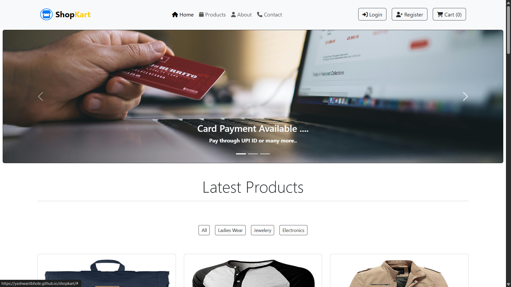
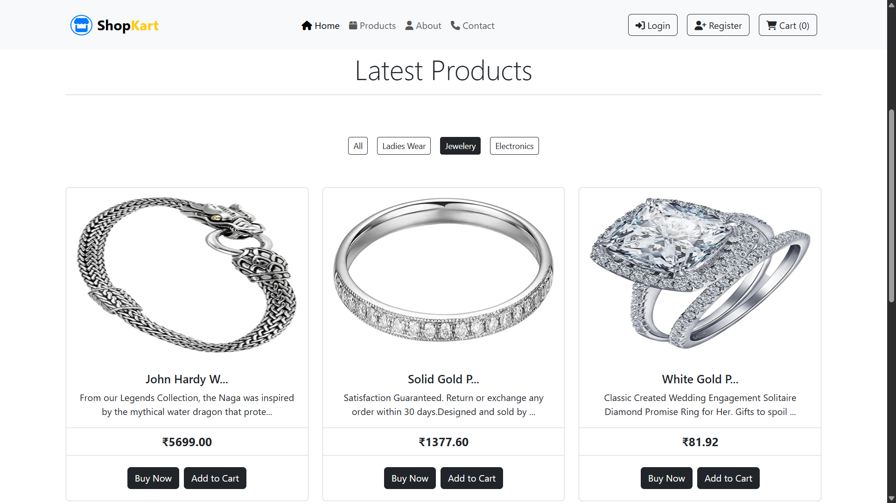
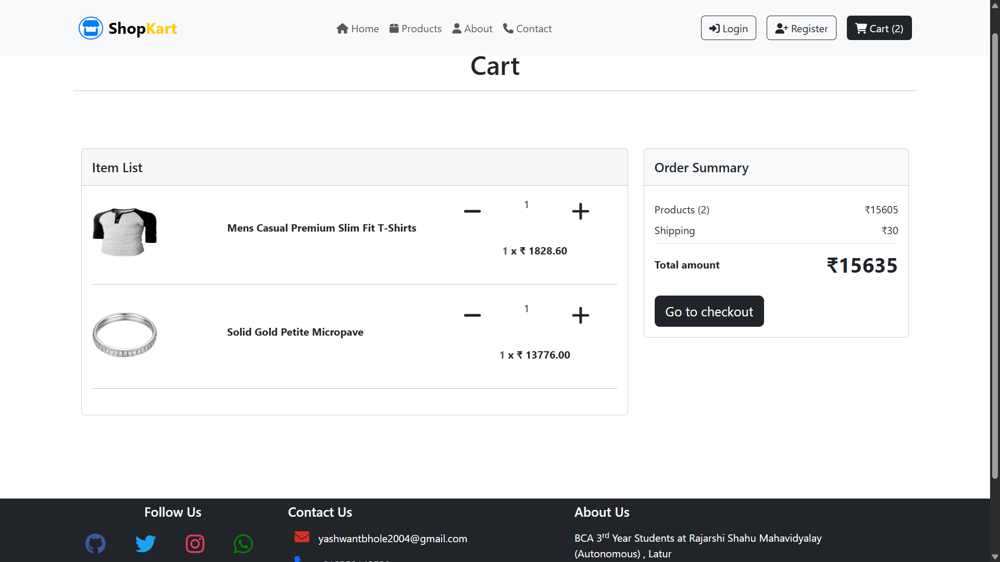
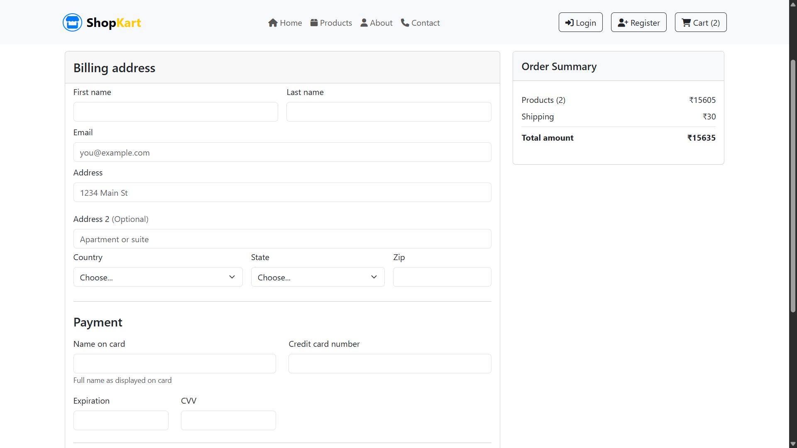

# 🛒 ShopKart  

A modern, user-friendly e-commerce platform offering seamless product browsing, dynamic shopping cart management, and a smooth checkout experience. Built to demonstrate React state management, category-based product filtering, and real-time cart updates.

Shop, browse, and manage your cart effortlessly! ⚡ 

A modern and user-friendly e-commerce platform offering seamless product browsing, shopping cart management, and a secure checkout experience.  

---

## 📖 Features  

- **User Authentication**: Sign Up, Sign In, and Profile Management.  
- **Product Listing**: Browse through a variety of products with filtering and sorting options.  
- **Cart Management**: Add, remove, and update product quantities in the cart.  
- **Free Shipping**: Indicator for free shipping eligibility.  
- **Responsive Design**: Optimized for mobile, tablet, and desktop devices.  
- **Smooth Animations**: Enhances user experience using Bootstrap animations.  

---

## 🖥️ Demo Screenshots

**1️⃣ Home/Product Listing**  


**2️⃣ Product categories and Filters**  


**3️⃣ Shopping Cart**  


**4️⃣ Checkout Page**  



## 🎯 Purpose  

ShopKart showcases a full-stack e-commerce platform built with React and Tailwind CSS. It highlights dynamic state management, modern UI design, and essential e-commerce functionalities.  

---

## 🚀 Demo  
https://yashwantbhole.github.io/shopkart/

---

## 🛠️ Technologies Used  

### **Frontend**  
- React  
- Bootstrap  
- Redux (for state management)  
- React Icons  

### **Backend**  
- Node.js  
- Express  
- LocalStorage (to store user sign up details) 

### **Tools**  
- Axios (for API requests)  
- Postman (for testing backend APIs)  
- GitHub Pages (for deployment)  
- EmailsJS (for email services)
---

## 📦 Installation  

Follow these steps to set up and run **ShopKart** locally:  

1. Clone the repository:  
   ```bash  
   git clone <repository-link>  

2. naviagte to project directory:
    ```bash  
    cd shopkart

 3. Install Dependencies:
    ```bash 
    npm install
4. start the server:
    ```bash
    npm start

    🌟 Usage
Explore Products: Browse the product catalog with categories and filtering.
Add to Cart: Select products and manage quantities in the shopping cart.
Checkout: Complete the purchase with a smooth checkout flow.

🔑 API Details
ShopKart uses a https://fakestoreapi.com/ backend API for product management and user authentication.

## 👤 Author & Connect With Me

<div align="center">

### **Yashwant Bhole**

<p align="center">  
  <a href="https://www.linkedin.com/in/yashwantbhole/" target="_blank">
    
  </a>
  <a href="mailto:yashwantbhole2004@gmail.com">
    
  </a>
  <a href="https://github.com/YashwantBhole" target="_blank">
    
  </a>
</p>

💼 *Full Stack Developer — MERN • Java • Spring Boot*  
🌟 *Building AI-powered systems with clean architecture and strong UI/UX.*

</div>

---

## ⭐ Feedback

If you found this project helpful, please ⭐ **star** the repository — it encourages me a lot!

